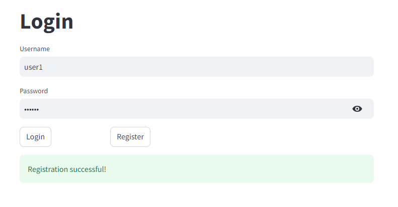

# llmui
A streamly simple Large Language Model User Interface(LLM-UI) with streamlit , in one python file

## install

1. locally
   1. install dependencies by
      
     ```
      pip install -r requirement.txt
      ```
   1. copy the llmui.py in your work directory
   2. run the command
      
      ```
      streamlit run llmui.py
     ```

## how to use

1. register with username and password



2. login with the registered user


3. config your openai compatible service information(only store in your own server, can be your own llm service like a vllm service)


4. begin to chat


5. user management
   1. as normal user, you can change your password or logout
   
  
   2. as root user, you can change any one's password or delete the user .etc.(you need to register a root user by your self)
   

6. other operation
   1. clean current session's chat history
   
   2. delete current session
   

## Feel free to submit issues
